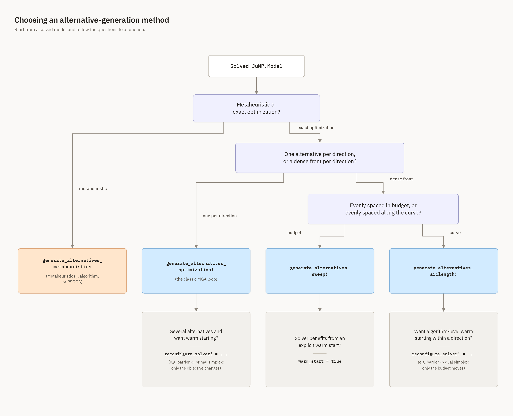

```@contents
Pages = ["10-how-to-use.md"]
Depth = 5
```

# How to use

This section covers installation and gives a quick-start example for each way of generating alternatives. For the full argument list of every function, see the [IO Reference](15-io.md); for the theory behind each modeling method and generation strategy, see [Concepts](30-concepts.md).

## Install

In Julia:

- Enter package mode (press "]")

```pkg
pkg> add NearOptimalAlternatives
```

- Return to Julia mode (backspace)

```julia
julia> using NearOptimalAlternatives
```

## Generating alternatives

Given a solved JuMP model `model` and the variables you want to consider, choose one of the four functions below depending on how you want alternatives to be generated. All of them return an `AlternativeSolutions`; see [Output](@ref io-output) for its structure.

### Which function should I use?



**When "metaheuristic" is the right branch, and when it isn't.** Reach for
`generate_alternatives_metaheuristics`/`PSOGA` when your model doesn't have a solver suited to many
repeated exact re-solves (e.g. a black-box or highly nonconvex model where an LP/QP-style optimization
pass isn't available or affordable), or when you specifically want a population-based search that
explores differently from a sequence of directed re-solves. Otherwise, prefer the optimization-based
branch: it is exact, deterministic (given the same solver/settings), and — for models like typical energy
system models, which are usually LPs or convex QPs with plenty of equality constraints (e.g. demand
balance) — considerably cheaper and more reliable, since population-based metaheuristics do not natively
enforce equality constraints and can spend most of their search on infeasible or near-infeasible
individuals (this package's own `PSOGA` inherits that same limitation; see
[PSOGA](@ref psoga-recommendations) below and
[issue #19](https://github.com/TulipaEnergy/NearOptimalAlternatives.jl/issues/19)). If you do go the
metaheuristic route, [Recommended algorithms](@ref metaheuristic-recommendations) below gives concrete
starting points instead of the full
[Metaheuristics.jl](https://jmejia8.github.io/Metaheuristics.jl/stable/algorithms/) list.

See [Alternative-Generation Strategies](@ref gen-strategies) for the theory behind the three optimization-based functions, and [Modeling Methods](@ref modeling-methods) for the `modeling_method` each of them also accepts (independently of the choices above). The table below summarises when to prefer each, since the chart above is clear on *what* you can choose but not on *why* one beats another for your situation:

| Function | Points returned | Prefer it when… | Main limitation | Cost per direction |
| :------- | :--------------- | :--------------- | :--------------- | :------------------ |
| `generate_alternatives_optimization!` | 1 per direction | you just want `n_alternatives` distinct options, nothing more | no visibility into the trade-off *within* a direction — only the full-budget corner | 1 solve |
| `generate_alternatives_sweep!` | `n_budget` per direction, evenly spaced **in cost** | you want the full cost/diversity trade-off and the front is expected to be roughly straight, or you don't want arclength's small predictor-corrector overhead | wastes points on flat stretches, under-samples sharp bends; no built-in solver-warm-start hook (use `warm_start=true` instead, see below) | `n_budget` solves |
| `generate_alternatives_arclength!` | `n_budget` per direction, evenly spaced **along the curve** | the front likely has a knee/bend and you want points concentrated there, not wasted on flat regions; or you want `reconfigure_solver!`-based warm-starting (Section~[Arclength Continuation](@ref arclength-continuation)) | a few extra solves beyond `n_budget` from rejected predictor steps; realised point count per direction can vary slightly | ≈`n_budget` solves + occasional rejected retries |
| `generate_alternatives_metaheuristics` / `PSOGA` | `n_alternatives` total | no suitable exact solver is available, or you want population-based exploration on purpose | stochastic and approximate — no feasibility/exactness guarantee; struggles on equality-heavy models (see above) | population size × iterations (set by you; typically far more model solves/evaluations than one LP re-solve) |

Cost here means LP/QP re-solves for the optimization-based rows, and objective/constraint evaluations for the metaheuristic row — the two are not directly comparable operation-for-operation, but the metaheuristic row is almost always the more expensive one in wall-clock time for a model where an exact re-solve is available at all.

### A minimal worked example

Before looking at each function, here is a complete, tiny example you can run and check by hand: a one-constraint "energy system" that meets a fixed demand of `10` units from a cheap and an expensive generator.

```@example basic
using JuMP, Ipopt

model = Model(Ipopt.Optimizer)
set_silent(model)
@variable(model, 0 <= x_cheap <= 15)
@variable(model, 0 <= x_expensive <= 15)
@constraint(model, demand, x_cheap + x_expensive == 10)
@objective(model, Min, 1 * x_cheap + 3 * x_expensive)
JuMP.optimize!(model)
clean(x) = round(max(x, 0.0); digits = 3)   # clamp away solver floating-point noise near the 0 lower bound
clean(value(x_cheap)), clean(value(x_expensive)), round(objective_value(model); digits = 3)
```

Since `x_expensive` costs three times as much per unit as `x_cheap`, the cost-minimal solution uses only the cheap generator: `x_cheap = 10`, `x_expensive = 0`, at a cost of `10`. This is the single point a normal optimization run reports, and it is exactly why MGA exists: nothing here tells you whether this all-cheap solution is fragile (relying entirely on one technology) or whether a nearly-as-good alternative uses the expensive generator too.

Let's ask for one alternative within `20%` of the optimal cost:

```@example basic
using NearOptimalAlternatives

optimality_gap = 0.2
variables = [x_cheap, x_expensive]
alternatives = generate_alternatives_optimization!(model, optimality_gap, variables, 1)
round(alternatives.solutions[1][x_cheap]; digits = 3),
round(alternatives.solutions[1][x_expensive]; digits = 3),
round(alternatives.objective_values[1]; digits = 3)
```

You can check this by hand: the budget constraint is `x_cheap + 3*x_expensive <= 12` (`20%` above the optimal cost of `10`), and the default `:Max_Distance` method pushes `x_expensive` as far from its optimal value of `0` as the budget allows. Since demand must still be met exactly, `x_cheap = 10 - x_expensive`; substituting into the budget gives `x_expensive <= 1`, so the alternative is `x_cheap = 9`, `x_expensive = 1`, at a cost of exactly `12` — the corner of the near-optimal region furthest from the original solution.

The rest of this section reuses this same generator setup (rebuilt fresh each time, since a model can only be turned into an alternative-generating problem once).

### One alternative per direction: `generate_alternatives_optimization!`

The classic MGA loop: find `n_alternatives` solutions, one per direction, each at the full near-optimal budget. Demonstrated above; to only change a subset of variables, fix the rest with `fixed_variables`:

```julia
fixed_variables = [x_expensive]   # x_expensive keeps its optimal value of 0.
alternatives = generate_alternatives_optimization!(
    model, optimality_gap, variables, n_alternatives; fixed_variables = fixed_variables,
)
```

### A dense front per direction: `generate_alternatives_sweep!`

Instead of one point per direction, sweep the cost budget to return `n_budget` points per direction, tracing a near-optimal front:

```@example basic
model_sweep = Model(Ipopt.Optimizer)
set_silent(model_sweep)
@variable(model_sweep, 0 <= x_cheap <= 15)
@variable(model_sweep, 0 <= x_expensive <= 15)
@constraint(model_sweep, demand, x_cheap + x_expensive == 10)
@objective(model_sweep, Min, 1 * x_cheap + 3 * x_expensive)
JuMP.optimize!(model_sweep)

front = generate_alternatives_sweep!(model_sweep, optimality_gap, [x_cheap, x_expensive], 1; n_budget = 3)
[(round(front.solutions[i][x_cheap]; digits = 3), round(front.objective_values[i]; digits = 3)) for i in eachindex(front.solutions)]
```

Since there are only two variables tied together by one equality constraint, the whole near-optimal region is the single line segment from `(10, 0)` to `(9, 1)`, and the sweep places `n_budget` points evenly along the cost axis of that segment — you can check each entry above lies at an even fraction of the way from cost `10` to cost `12`.

### An arclength-spaced front per direction: `generate_alternatives_arclength!`

Like the sweep, but spaces the `n_budget` points evenly along the trade-off curve rather than the budget axis:

```@example basic
model_arc = Model(Ipopt.Optimizer)
set_silent(model_arc)
@variable(model_arc, 0 <= x_cheap <= 15)
@variable(model_arc, 0 <= x_expensive <= 15)
@constraint(model_arc, demand, x_cheap + x_expensive == 10)
@objective(model_arc, Min, 1 * x_cheap + 3 * x_expensive)
JuMP.optimize!(model_arc)

front_arc = generate_alternatives_arclength!(model_arc, optimality_gap, [x_cheap, x_expensive], 1; n_budget = 3)
[(round(front_arc.solutions[i][x_cheap]; digits = 3), round(front_arc.objective_values[i]; digits = 3)) for i in eachindex(front_arc.solutions)]
```

On this two-variable example the trade-off curve is a straight line, so the arclength and budget spacings coincide; the difference between the two strategies only shows up once the near-optimal front actually curves, which is the normal case for a real model with many variables (see [Arclength Continuation](@ref arclength-continuation) for the intuition behind why, with a figure — the "arclength" name refers to distance *along the cost-vs-diversity curve*, not a constraint on how many decision variables the model has).

**Sweep or arclength?** Both return `n_budget` points per direction; the only question is how those points are spaced. Reach for arclength whenever you don't already know the front is close to a straight line — it costs a handful of extra solves (from occasional rejected predictor steps) in exchange for not wasting points on flat stretches. Reach for sweep instead when you specifically want evenly-spaced-in-cost points (e.g. to compare cost levels directly across directions), or when you want the `warm_start` boolean rather than `reconfigure_solver!` for warm-starting (see the comparison table above and the [warm-starting tutorial](@ref warm-start-tutorial) below).

### Using a metaheuristic algorithm: `generate_alternatives_metaheuristics`

Generate alternatives with an algorithm from [Metaheuristics.jl](https://github.com/jmejia8/Metaheuristics.jl) instead of mathematical optimization:

```@example basic
using Metaheuristics

model_meta = Model(Ipopt.Optimizer)
set_silent(model_meta)
@variable(model_meta, 0 <= x_cheap <= 15)
@variable(model_meta, 0 <= x_expensive <= 15)
@constraint(model_meta, demand, x_cheap + x_expensive == 10)
@objective(model_meta, Min, 1 * x_cheap + 3 * x_expensive)
JuMP.optimize!(model_meta)

metaheuristic_algorithm = Metaheuristics.PSO()
meta_alt = generate_alternatives_metaheuristics(model_meta, optimality_gap, 1, metaheuristic_algorithm)
round(meta_alt.solutions[1][x_cheap]; digits = 3), round(meta_alt.solutions[1][x_expensive]; digits = 3)
```

Metaheuristic results are approximate and stochastic, unlike the optimization-based functions above — on a problem this small and dominated by a single equality constraint, a metaheuristic may even settle back on the exact optimum rather than a diverse alternative; they are much more useful on larger, less tightly-constrained problems.

As with the optimization-based functions, `fixed_variables` can be supplied, and the distance `metric` can be changed (weighted metrics are supported too):

```julia
using Distances

metric = Distances.Euclidean()   # Use Euclidean instead of the default SqEuclidean.
alternatives = generate_alternatives_metaheuristics(
    model, optimality_gap, n_alternatives, metaheuristic_algorithm; metric = metric,
)
```

The parameters of `metaheuristic_algorithm` are set when constructing it; see the [Metaheuristics.jl documentation](https://jmejia8.github.io/Metaheuristics.jl/stable/) for the full list of algorithms it provides.

#### [Recommended algorithms](@id metaheuristic-recommendations)

Not every algorithm in Metaheuristics.jl is a good fit for an energy system model. **None of them natively handle equality constraints** (like the demand-balance constraint in every example on this page) — they only know your model through the objective and constraint-violation values `generate_alternatives_metaheuristics` computes at each candidate point, and a population-based search that must satisfy an equality exactly has very little of the search space to work with. Expect noticeably more constraint violation, and a slower/less complete near-optimal region, than the optimization-based functions above return exactly. Two reasonably robust, general-purpose starting points for continuous, box-constrained problems like this one:

- `Metaheuristics.DE()` (Differential Evolution) — a solid default for continuous real-parameter problems, few parameters to tune.
- `Metaheuristics.PSO()` (Particle Swarm Optimization, used in the example above) — similarly robust, tends to converge faster on smoother objectives but can lose diversity earlier.

`Metaheuristics.ECA()` (Evolutionary Centers Algorithm) is Metaheuristics.jl's own general-purpose default and a fine third option. We do not recommend starting with population-based metaheuristics on models with many tight equality constraints at all — try the optimization-based functions first, and only reach for a metaheuristic if no MathOptInterface-compatible solver is available for your model.

#### [Using PSOGA, this package's own metaheuristic](@id psoga-recommendations)

`PSOGA` is used the same way as any other metaheuristic, except it needs the number of alternatives up front, so it knows how many subpopulations to keep:

```julia
metaheuristic_algorithm = PSOGA(N_solutions = n_alternatives)
alternatives = generate_alternatives_metaheuristics(model, optimality_gap, n_alternatives, metaheuristic_algorithm)
```

!!! warning "Known limitation: is PSOGA ready to use?"
    `PSOGA` is not yet fully ready for models with tight equality constraints — the same limitation as the general Metaheuristics.jl algorithms above, but sharper, since PSOGA's only defense against infeasibility today is preferring whichever individual has the smallest constraint violation ([issue #19](https://github.com/TulipaEnergy/NearOptimalAlternatives.jl/issues/19)); there is no repair or projection step yet. It has also not been benchmarked on problems larger than the small examples in this documentation ([issue #21](https://github.com/TulipaEnergy/NearOptimalAlternatives.jl/issues/21)), so treat its performance on a full-size energy system model as unverified rather than assumed. Use it for smaller or more loosely-constrained models today, and check those issues for progress before relying on it at scale.

## [Warm-starting a direction with `reconfigure_solver!`](@id warm-start-tutorial)

`generate_alternatives_optimization!` and `generate_alternatives_arclength!` both accept a `reconfigure_solver!` callback (see the [IO Reference](15-io.md) for its exact signature). Its job is to switch the attached solver's *algorithm* — not the model — partway through generation, so later solves start from the previous solve's basis instead of solving cold. Whether that helps depends entirely on how big the change is between successive solves:

- In `generate_alternatives_optimization!`, only the *objective* changes between alternatives (the direction). That is the textbook case for a **primal**-simplex warm start.
- In `generate_alternatives_arclength!`, only the *budget* (the near-optimal cost constraint's right-hand side) moves within a direction — the textbook case for a **dual**-simplex warm start — but a direction change is an objective change, so the natural combined pattern (below) also brings primal simplex back in between directions.

`reconfigure_solver!` only *sets solver attributes* — the package itself handles the mandatory re-solve after the attribute change. The exact attribute names are solver-specific; the example below uses Gurobi's (`"Method"`: `2` = barrier, `0` = primal simplex, `1` = dual simplex; `"Crossover"`: `0` = off, `-1` = on), since Gurobi is the most common solver this package is used with in practice, but the same idea applies to any solver whose MathOptInterface wrapper exposes an algorithm-choice attribute (e.g. HiGHS's `"solver"` string attribute).

### Warm-starting `generate_alternatives_optimization!` (primal simplex)

```julia
using JuMP, Gurobi

model = Model(Gurobi.Optimizer)
set_optimizer_attribute(model, "Method", 2)      # barrier
set_optimizer_attribute(model, "Crossover", 0)   # off, for a fast *initial* cost-min solve
@variable(model, 0 <= x_cheap <= 15)
@variable(model, 0 <= x_expensive <= 15)
@constraint(model, demand, x_cheap + x_expensive == 10)
@objective(model, Min, 1 * x_cheap + 3 * x_expensive)
JuMP.optimize!(model)

# Alternative #1 needs a simplex-ready vertex to warm-start FROM: barrier's own
# solution is an interior point, not a basis, so re-solve once with crossover on.
set_optimizer_attribute(model, "Crossover", -1)
JuMP.optimize!(model)

to_primal_simplex!(m) = set_optimizer_attribute(m, "Method", 0)

alternatives = generate_alternatives_optimization!(
    model, 0.2, [x_cheap, x_expensive], 5;
    reconfigure_solver! = to_primal_simplex!,
)
```

`reconfigure_solver!` fires once, right after alternative #1 is found, and switches every solve after that to primal simplex — each one now starts from the previous alternative's basis instead of from scratch. This is only worth the one-time crossover cost when you're generating enough alternatives (`n_alternatives`) that the savings on the remaining solves outweigh it; for a handful of alternatives on a small model, plain cold barrier (no `reconfigure_solver!` at all) is often just as fast, or faster — the crossover step itself is not always cheap or even reliable on a large, ill-conditioned model, so measure before committing to this pattern at scale.

### Warm-starting `generate_alternatives_arclength!` (dual simplex within a direction, primal simplex between directions)

The setup is the same, but `reconfigure_solver!` here fires once *per direction*, right after that direction's first point, and returns a closure that runs once at the *start of the next* direction — because arclength solves budgets out of order within a direction, but a new direction is a fresh objective, which is exactly what primal simplex is warm-starting for in the first place. So rather than treating "warm-start within a direction" and "warm-start across directions" as two separate ideas, one `reconfigure_solver!` covers both at once: dual simplex for the rest of the current direction's points, and the *returned closure* switches straight to primal simplex for the next direction's first point — no restore-to-barrier step needed in between.

```julia
to_dual_simplex!(m) = set_optimizer_attribute(m, "Method", 1)
to_primal_simplex!(m) = set_optimizer_attribute(m, "Method", 0)

front = generate_alternatives_arclength!(
    model, 0.2, [x_cheap, x_expensive], 3;   # 3 directions
    n_budget = 5,
    reconfigure_solver! = m -> begin
        to_dual_simplex!(m)
        to_primal_simplex!   # returned, not called: this is the restore closure
    end,
)
```

`to_primal_simplex!` is returned *uncalled* — it already has the `model -> nothing` shape `reconfigure_solver!`'s return value needs, so there is nothing to wrap it in. The package applies it automatically at the start of the next direction, right after that direction's objective is updated. Every direction therefore opens on primal simplex (warm from the previous direction's basis) and switches to dual simplex once its own budget starts moving — one algorithm for each of the two things that actually change in this function, with no separate crossover-restore step to write yourself. If you don't need this and just want dual-within-direction with no cross-direction carry-over, return `nothing` instead of the function reference.
