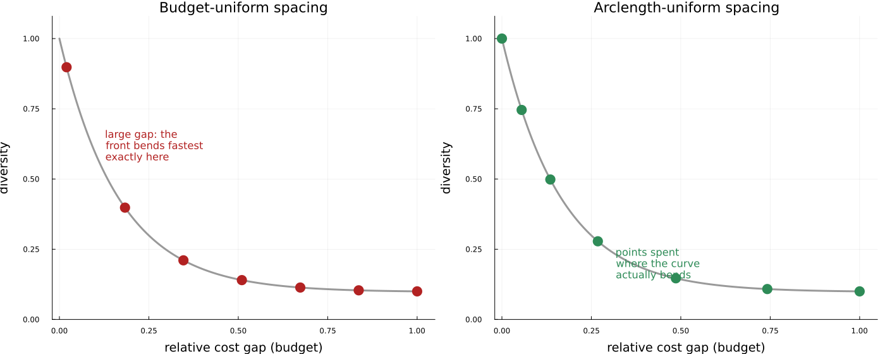

```@contents
Pages = ["concepts.md"]
Depth = 5
```

# Concepts

Here we explain in more detail the underlying theoretical concepts of NearOptimalAlternatives.jl. We first discuss the optimization-based approaches and then discuss the evolutionary approaches.

## System Architecture

Both pathways start from the same solved model and near-optimal budget constraint, then diverge: the optimization-based pathway repeatedly re-solves the same JuMP model with a method-specific objective, while the evolutionary pathway translates the problem once into a self-contained search space for a population-based algorithm. Both converge on the same `AlternativeSolutions` output.


## [Optimization-based Methods](@id opt-based-methods)

One can directly maximize the distance among the alternatives or minimized the weighted sum of decision variables using a variety of methods listed below.

### Max-Distance (`:Max_Distance`)

- Files: `MGA-Methods/Max-Distance.jl`
- Goal: maximize distance between the current solution and the reference solution using a chosen metric (default: squared Euclidean; updates default to Cityblock).
- Behavior: `Dist_initial!` fixes specified variables, captures the current solution, and sets a distance-maximizing objective. `Dist_update!` adds additional distance terms to encourage further diversity across iterations.

Given the optimal solution $x^*$, we solve the following problem for any distance metric $d$.

```math
\text{Maximize} || x - x^* ||_d \\
```

### Hop-Skip-Jump (`:HSJ`)

- Files: `MGA-Methods/HSJ.jl`
- Goal: minimize a weighted sum where weights are 1 for nonzero variables and 0 otherwise, biasing the search away from the current support.
- Behavior: `HSJ_initial!` fixes requested variables and sets weights from the current solution; `HSJ_update!` recomputes weights from the latest solution before re-solving.
- Hop-Skip-Jump (HSJ) [^HSJ1982] is a method that tries to find alternatives by minimizing the variables that had a non-zero value in the previous iteration. This is done to find alternatives that invest less in the decision variable, which was already invested in in the previous iteration. More precisely, it minimizes based on the value of the variables in the previous iteration.
The objective is to minimize the weighted sum of decision variables $x_i$ using weights $w_i^{k}$ where $i$ is the index of variables and $k$ is the index of iterations.

```math
w_i^{k} = \begin{cases}
0, & \text{if } x_i^{k-1} = 0 \\
1, & \text{otherwise.}
\end{cases}
```

### Spores (`:Spores`)

- Files: `MGA-Methods/Spores.jl`
- Goal: shift emphasis toward variables that could take larger values relative to their upper bounds (upper bounds required for all variables involved).
- Behavior: `Spores_initial!` and `Spores_update!` accumulate weights as `weights[i] += value(v) / upper_bound(v)` and minimize the resulting weighted sum.
- Spores [^SPORES2020] is a modification of HSJ. It does not discard the weights of the previous iteration. Instead, it updates them using the update rule as described below. This equation introduces $x^{max}_i$ , which refers to the maximum possible value that $x_i$ can take. This update rule assigns a high weight to variables whose value is close to the maximum value, while assigning a low weight to variables whose value is close to zero. This is similar to the HSJ method, but with the ability to be more expressive.

The objective is to minimize the weighted sum of decision variables $x_i$ using weights $w_i^{k}$ where $i$ is the index of variables and $k$ is the index of iterations.

```math
w_i^k = w_i^{k-1} + \frac{x_i^{k-1}}{x_i^{\text{max}}}, \quad \forall k, 1 \leq k \leq n,
```

```math
w_i^0 = 0.
```

!!! info "Variables without an upper bound"
    SPORES needs $x_i^{\text{max}}$ for every variable it scores, so **every variable passed to SPORES
    must have a finite upper bound** — `Spores_initial!`/`Spores_update!` raise an `ArgumentError`
    immediately if one doesn't (checked before any solve, not left to fail silently; a variable with an
    upper bound of exactly `0` is handled differently and needs no special care — SPORES just skips it,
    weight contribution `0` regardless). If your model has a variable with no natural capacity limit, you
    have three options:
    - Give it a large-but-finite bound if a sensible one exists (e.g. an installed-capacity cap well above anything the optimizer would realistically choose).
    - Leave it out of the `variables` argument passed to `generate_alternatives_optimization!`/`_sweep!`/`_arclength!`. SPORES then simply never perturbs that variable — it is neither part of the near-optimal search nor fixed, just outside SPORES' scoring.
    - Use a different modeling method instead — every other method on this page (Max-Distance, HSJ, Min/Max Variables, Random Vector, Directionally Weighted Variables) works on unbounded variables; SPORES is the only one that requires them.

### Min/Max Variables (`:Min_Max_Variables`)

- Files: `MGA-Methods/Min-Max-Variables.jl`
- Goal: randomly push variables to be minimized, maximized, or ignored to explore diverse corners of the feasible region.
- Behavior: both `*_initial!` and `*_update!` draw weights uniformly from `{-1, 0, 1}` and minimize the weighted sum.
- Min/Max Variables [^Evelina2012][^Lukas2019] is an approach that minimizes and/or maximizes a random sample of variables. This is done by randomly sampling the weights as specified below. Contrary to HSJ and Spores, the Min/Max Variables does not consider any previously found alternatives. When applying this approach, all variables with weight 1 get minimized, the variable with weight −1 gets maximized, and the variables with weight 0 are free.

The objective is to minimize the weighted sum of decision variables $x_i$ using weights $w_i^{k}$ where $i$ is the index of variables and $k$ is the index of iterations.

```math
w_i \sim \text{Uniform}(\{−1, 0, 1\}), \forall i
```

### Random Vector (`:Random_Vector`)

- Files: `MGA-Methods/Random-Vector.jl`
- Goal: similar to Min/Max Variables but with continuous random weights in [-1, 1] for smoother perturbations.
- Behavior: each call redraws weights from `Uniform(-1, 1)` and minimizes the weighted sum.
- Random Vector [^RANDV2017] is similar to Min/Max Variables. Where Min/Max Variables samples either −1, 0, or 1, Random Vector samples a predefined distribution for all variables, most of the time this distribution is the uniform distribution between −1 and 1, as described below. However, the distribution can be different for each variable to best fit the model being solved.

The objective is to minimize the weighted sum of decision variables $x_i$ using weights $w_i^{k}$ where $i$ is the index of variables and $k$ is the index of iterations.

```math
w_i \sim \text{Uniform}(−1, 1), \forall i
```

### Directionally Weighted Variables (`:Directionally_Weighted_Variables`)

- Files: `MGA-Methods/Directionally-Weighted-Variables.jl`
- Goal: choose variable directions based on the sign of their coefficients in the original objective to promote directional diversity. This helps to find non-dominated solutions. For the concept of dominance, check out [^VandeLaar2025].
- Behavior: weights depend on objective coefficients (`>0` draws from {0,1}, `<0` from {-1,0}, else {-1,0,1}); `DWV_initial!` fixes requested variables, sets the weighted-sum objective, and `DWV_update!` redraws weights before the next solve.

## [Alternative-Generation Strategies](@id gen-strategies)

The methods above choose which *direction* to search in at each iteration (the objective used to find the next alternative). Separately, the package offers three strategies for how many points are collected per direction and how the cost budget between the optimum and the near-optimal boundary is walked to reach them. All three work with any of the modeling methods above.

### [Single Point per Direction (`generate_alternatives_optimization!`)](@id single-point)

- Files: `generate-alternatives.jl`
- Goal: find exactly one alternative per direction, at the full near-optimal budget.
- Behavior: sets up the problem once, then alternates between `update_objective_function!` (pick the next direction) and a single solve at the budget boundary, for `n_alternatives` iterations. This is the classic MGA loop.

### [Budget Sweep (`generate_alternatives_sweep!`)](@id budget-sweep)

- Files: `sweep-alternatives.jl`
- Goal: return a dense near-optimal front per direction instead of a single point.
- Behavior: for each direction, the budget is stepped through `n_budget` evenly-spaced levels between the tight and full budget, recording every intermediate optimum. Each direction still ends at the full budget, so directions that accumulate from the previous solution (SPORES, HSJ) advance the same way as the single-point method.

### [Arclength Continuation (`generate_alternatives_arclength!`)](@id arclength-continuation)

- Files: `arclength-alternatives.jl`
- Goal: like the budget sweep, but places the `n_budget` points evenly *along the trade-off curve* (cost vs. diversity) instead of evenly along the budget axis, so points are not wasted where the front is flat and are concentrated where it curves sharply.

**The intuition.** "Arclength" is not a 2D-only idea, even though it sounds like one — it refers to the
length along the *cost-vs-diversity curve*, a 2D summary plot you get by plotting each alternative's cost
against its diversity value, regardless of whether the underlying model has 3 variables or 3 million.
Every point on that curve is a full alternative in the model's own (possibly huge) variable space; the
curve itself just tracks two numbers per point. Picture a hiking trail traced on a map: if you place rest
stops at even *map distance* apart, you'll cluster stops uselessly on the flat, easy stretches and skip
past the steep switchbacks where the trail actually changes direction. Placing stops at even *distance
walked along the trail* instead puts more stops exactly where the path bends and fewer where it runs
straight. Budget-uniform spacing is the first kind of stop-placement (even in cost); arclength spacing is
the second (even along the curve) — see the figure below for what this looks like on a front that starts
steep and flattens out, the shape most near-optimal fronts actually have.



- Behavior: a pseudo-arclength predictor-corrector scheme [^Keller1977][^AllgowerGeorg1990]. The two budget endpoints are solved first to anchor and normalise the (cost, diversity) metric. Each subsequent budget is then *predicted* from a finite-difference tangent, so every step advances a fixed target arclength, and *corrected* by an exact solve at that budget. A budget that fails to solve is stepped over rather than aborting the direction. The same idea has been used to trace Pareto fronts in multi-objective optimization [^Hillermeier2001][^Schutze2005].
- `reconfigure_solver!` lets the solver's algorithm be switched (e.g. barrier to dual simplex) once per direction, right after that direction's first point, so the rest of that direction's points can warm-start off the resulting basis. See the [warm-starting tutorial](@ref warm-start-tutorial) and the [IO Reference](15-io.md) for details.

## Evolutionary Methods

Evolutionary algorithms have been proposed as an alternative method to mathematical programming for generating alternative solutions by Zechman and Ranjithan [^Zechman].

Their method works as follows. Instead of simply initializing an initial population as a regular evolutionary algorithm would do, they divide this population into $P$ subpopulations, where $P$ is equal to the number of alternative solutions to be found. Each subpopulation is dedicated to search for one alternative solution. The first subpopulation can also be used to find the global optimum. After initializing the population, they take the following steps iteratively. First, evaluate all individuals with respect to the objective and feasibility. Also, the distance between this solution and other subpopulations, or there centroids, is taken into account. So, the best individual is a feasible solution which is furthest away from other subpopulations. They used elitism to preserve the best solution in each subpopulation. Afterwards, after checking stopping criteria, they applied binary tournament selection based on the fitness of the solution to select the rest of the individuals.

### Particle Swarm Optimization for Generating Alternatives (PSOGA)

In this package we developed PSOGA, an modification of Evolutionary Algorithms for Generating Alternatives using Particle Swarm Optimization (PSO).

- Files: `algorithms/PSOGA/PSOGA.jl` and `algorithms/PSOGA/is_better.jl`.
- Goal: maximize distance from provided solution within search space
- Behavior: `initialize!` initializez population and global parameters. `update_state!` performs one loop of he metaheuristic process. `final_stage!` performs final steps after solving the problem.

It works as follows.

When initializing the algorithm, the population of individuals is divided into $n$ equal-size subpopulations, where $n$ is the number of alternative solutions sought. As with regular PSO, each individual has a position $x$ and a velocity $v$.

The update step of the algorithm works very similar to regular PSO. In every iteration, each individual is updated as follows. First, its velocity is updated and becomes
$$v = \omega \cdot v + \textit{rand}(0,1) \cdot c_1 \cdot (p_{\textit{best}} - x)  + \textit{rand}(0,1) \cdot c_2 \cdot (s_{\textit{best}} - x).$$
In the above equation, $\omega$ represents the inertia, $c_1$ is the cognitive parameter and $c_2$ is the social parameter. These make sure that the old velocity is taken into account, previous information from this individual is used and information from other individuals in the subpopulation is used, respectively. Therefore, the variables $p_\textit{best}$, representing the personal best position of this individual, and $s_\textit{best}$,representing the alltime best of the subpopulation this individual is in, are required. Note that $s_\textit{best}$ replaces $g_\textit{best}$, which is used in regular PSO and represents the global best solution of the full population.

After updating the velocity of each individual, all positions are updated using $x = x + v$. Subsequently, all personal bests and subpopulation bests are updated based on the objective value. For PSOGA the objective is to generate alternatives that are as different as possible from the optimal solution, but also from each other. The aim here is to make sure each subpopulation finds one alternative, and these are spread out over the search space.

When comparing two solutions to decide which is better, we therefore take the following approach. If either of the solutions is infeasible, we take the solution with the smallest constraint violation. If none are infeasible we pick the one with the largest distance, where the distance can be defined in two ways. Either, we calculate the sum of all distances to other subpopulations and to the original optimal solution, or we calculate the minimum of the distances to other subpopulations and the original optimal solution. To compute the distance to other subpopulations, we calculate the centroid (average) of all points in the subpopulation and compute the distance to that centroid.

The algorithm terminates when the subpopulations have converged, or the maximum number of iterations has been met. By then, the subpopulations should be spread out over the feasible space and as far as possible from the initial optimal solution.

## References

[^AllgowerGeorg1990]: Eugene L. Allgower and Kurt Georg. Numerical Continuation Methods: An Introduction. Springer Series in Computational Mathematics, vol. 13. Springer-Verlag, 1990.
[^Evelina2012]: Evelina Trutnevyte et al. “Context-specific energy strategies: coupling energy system visions with feasible implementation scenarios”. In: Environmental science & technology 46.17 (2012), pp. 9240–9248
[^Hillermeier2001]: Claus Hillermeier. Nonlinear Multiobjective Optimization: A Generalized Homotopy Approach. International Series of Numerical Mathematics, vol. 135. Birkhäuser Basel, 2001.
[^HSJ1982]: E Downey Brill Jr, Shoou-Yuh Chang, and Lewis D Hopkins. “Modeling to generate alternatives: The HSJ approach and an illustration using a problem in land use planning”. In: Management Science 28.3 (1982), pp. 221–235.
[^Keller1977]: Herbert B. Keller. “Numerical solution of bifurcation and nonlinear eigenvalue problems”. In: Applications of Bifurcation Theory, ed. Paul H. Rabinowitz. Academic Press, 1977, pp. 359–384.
[^Lukas2019]: Lukas Nacken et al. “Integrated renewable energy systems for Germany–A model-based exploration of the decision space”. In: 2019 16th international conference on the European energy market (EEM). IEEE. 2019, pp. 1–8.
[^RANDV2017]: Philip B Berntsen and Evelina Trutnevyte. “Ensuring diversity of national energy scenarios: Bottomup energy system model with Modeling to Generate Alternatives”. In: Energy 126 (2017), pp. 886–898.
[^Schutze2005]: Oliver Schütze, Alessandro Dell'Aere, and Michael Dellnitz. “On Continuation Methods for the Numerical Treatment of Multi-Objective Optimization Problems”. In: Dagstuhl Seminar Proceedings 04461: Practical Approaches to Multi-Objective Optimization. Schloss Dagstuhl–Leibniz-Zentrum für Informatik, 2005.
[^SPORES2020]: Francesco Lombardi et al. “Policy decision support for renewables deployment through spatially explicit practically optimal alternatives”. In: Joule 4.10 (2020), pp. 2185–2207.
[^VandeLaar2025]: Luuk van de Laar. "Dominance-Aware Generation of Near-Optimal Alternatives in Energy System Models", TU Delft thesis, 2025
[^Zechman]: E. M. Zechman and S. R. Ranjithan, “An evolutionary algorithm to generate alternatives (eaga) for engineering optimization problems,” Engineering Optimization, vol. 36, no. 5, pp. 539–553, 2004.
